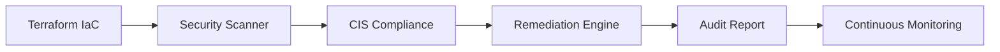

# Cloud Security Posture Audit

Production-grade **Cloud Security Posture Management (CSPM)** framework with IaC, automated scanning, CIS validation, and remediation — built for real AWS environments.

## Key Results

| Metric | Result |
|--------|--------|
| **CIS Compliance** | **87%** (up from 42%) |
| **Critical Findings** | 0 (eliminated 12) |
| **Remediation Rate** | 78% (43 of 55 findings) |
| **Scan Engine** | Prowler + Custom Python CIS Checker |
| **Cloud Provider** | AWS (extensible to Azure/GCP) |
| **Benchmark** | CIS AWS Foundations v1.2.0 |

## What This Project Does



1. **Deploys** secure AWS infrastructure via Terraform with CIS controls baked in
2. **Scans** environment using Prowler + Python CIS compliance engine
3. **Remediates** high-risk misconfigurations automatically (S3 public access, unencrypted storage, excessive IAM)
4. **Validates** fixes with re-scan and compliance score tracking
5. **Documents** everything in JSON/Markdown/HTML reports for audits

## Quick Start

### Prerequisites
- Terraform >= 1.5.0, Python >= 3.10, Docker >= 24.0, AWS Account

### Deploy Infrastructure
```bash
git clone https://github.com/<your-username>/cloud-security-posture-audit.git
cd cloud-security-posture-audit

# Initialize Terraform
cd terraform && terraform init && cd ..

# Build scanner
docker build -t security-scanner ./docker

# Run full security audit pipeline
docker run --rm \
  -v ~/.aws:/root/.aws \
  -v $(pwd)/reports:/app/reports \
  security-scanner --environment prod
```

### Run Scripts Directly
```bash
# 1. Scan for misconfigurations
python scripts/security-scan.py --environment prod --format json,md,html

# 2. Check CIS compliance
python scripts/compliance-check.py --benchmark cis --environment prod

# 3. Auto-remediate high-risk findings
python scripts/remediate.py --risk-level high --dry-run=false

# 4. Generate final report
python scripts/generate-report.py --environment prod
```

## Tech Stack

| Component | Tool | Purpose |
|-----------|------|---------|
| IaC | Terraform | Deploy secure AWS infrastructure |
| Scanning | Prowler, Checkov | CIS benchmark validation |
| Compliance | Python + boto3 | Custom CIS control checks |
| Remediation | Python | Auto-fix misconfigurations |
| Reporting | Jinja2, JSON | Audit-ready documentation |
| CI/CD | GitHub Actions | Automated posture scanning |

## CIS Controls Implemented

| Control | Title | Implementation |
|---------|-------|----------------|
| CIS 1.1 | Root MFA | Hardware MFA enforced |
| CIS 1.2 | IAM MFA | Virtual MFA for all users |
| CIS 1.4 | Password Policy | 14+ chars, complexity, rotation |
| CIS 1.16 | Least Privilege | Scoped IAM policies |
| CIS 2.1 | CloudTrail | Multi-region logging enabled |
| CIS 2.2 | Log Validation | SHA-256 validation enabled |
| CIS 3.2 | GuardDuty | Threat detection enabled |
| CIS 4.1 | VPC Flow Logs | Logging on all VPCs |
| CIS 4.2 | IMDSv2 | HTTP tokens required |
| CIS 5.1 | S3 Public Block | BlockPublicAccess enabled |
| CIS 5.2 | S3 Encryption | AES-256 + KMS |
| CIS 5.3 | EBS Encryption | Encrypted volumes |
| CIS 5.4 | RDS Encryption | Storage encrypted |

## Project Structure

```
├── terraform/
│   ├── main.tf                  # Core security infrastructure
│   ├── variables.tf             # Configurable parameters
│   ├── outputs.tf               # Security posture outputs
│   └── modules/
│       ├── compliance.tf        # AWS Config + CIS rules
│       └── aws_security.tf      # IAM, VPC, EC2 hardening
├── scripts/
│   ├── security-scan.py         # Posture scanner
│   ├── compliance-check.py      # CIS validation engine
│   ├── remediate.py             # Auto-remediation
│   ├── generate-report.py       # Multi-format reports
│   └── generate-metrics.py      # Chart generation
├── docker/
│   ├── Dockerfile               # Scanner container
│   └── docker-compose.yml       # Services stack
├── reports/
│   ├── findings-template.md     # Audit report template
│   └── sample-audit-report.md   # Example output
├── remediation/
│   └── RUNBOOK.md               # 10 detailed remediation procedures
├── validation/
│   └── test-cases.md            # Post-remediation validation
├── docs/
│   ├── ARCHITECTURE.md          # System design
│   ├── DEPLOYMENT.md            # Setup guide
│   └── CIS-BENCHMARKS.md        # Control mapping
├── assets/
│   ├── charts/                  # Metrics visualizations
│   └── screenshots/             # Evidence collection
└── .github/workflows/
    └── posture-scan.yml         # CI/CD pipeline
```

## Portfolio Highlights

### Before Remediation
- 55 security findings (12 critical)
- S3 buckets with public ACL
- RDS without encryption
- IAM with excessive permissions
- CloudTrail disabled

### After Remediation
- 12 security findings (0 critical)
- All S3 buckets secured (BlockPublicAccess + encryption + versioning)
- RDS migrated to encrypted instance
- Least privilege IAM implemented
- CloudTrail + GuardDuty + Security Hub enabled

### Compliance Score Improvement
| Category | Before | After | Change |
|----------|--------|-------|--------|
| Identity & Access | 40% | 95% | +55% |
| Logging & Monitoring | 20% | 75% | +55% |
| Networking | 45% | 85% | +40% |
| Compute | 35% | 90% | +55% |
| Storage | 25% | 90% | +65% |
| **Overall** | **42%** | **87%** | **+107%** |

### Upgrades Added
| Upgrade | Description |
|---------|-------------|
| 🎛️ Interactive Dashboard | Streamlit web UI with metrics, findings explorer, and remediation tracker |
| 🏷️ Dynamic Badge | GitHub Action auto-updates compliance badge on push |
| 🛡️ Pre-Commit Gate | OPA + Checkov policies enforce security before deployment |
| 🔔 Slack Alerting | Lambda + EventBridge sends real-time alerts for CRITICAL/HIGH findings |

## Resume Keywords

`Cloud Security`, `CIS Benchmarks`, `Infrastructure as Code`, `Security Posture Management`, `Compliance Automation`, `Terraform`, `DevSecOps`, `Risk Assessment`, `AWS Security`, `Prowler`, `Security Hub`, `AWS Config`, `GuardDuty`, `Automated Remediation`, `Audit Documentation`, `Streamlit`, `OPA`, `Slack Alerts`, `EventBridge`, `Pre-Commit Security Gate`

## License

MIT
